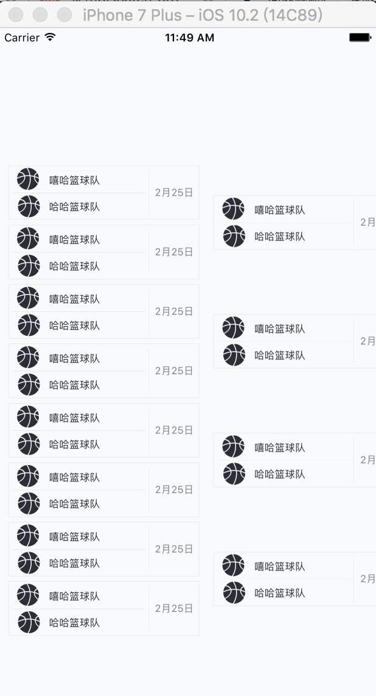

# KnockoutMatch
[TOC]

-----------
## 功能介绍
1. 支持任意大于等于2的队伍的对阵图的展示；
2. 每一轮的队伍数不用补位成2的N次方，也可以展示；
3. 可配置是否展示3、4名的对阵信息。

------------------
## 如何使用
* 将KnockoutMatch目录下的Classes加入到工程中
* 如果使用pod
	pod 'KnockoutMatch', '~> 0.0.1'
* 运行效果图

